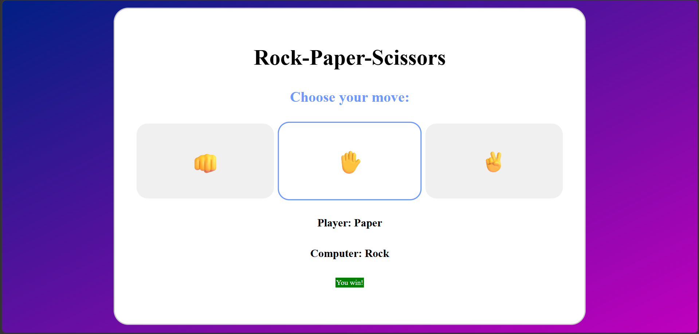

# 👊 ✋ ✌️ Rock-Paper-Scissors

Welcome! This is **my first project** on my journey to learning web development. I built this to practice and apply the absolute basics of **HTML5**, **CSS3** and **JavaScript**.

## 🎮 About the Project

This is a digital version of the classic "Rock, Paper, Scissors" game where you play against a computer opponent that makes 100% random choices. Building this helped me understand how on-screen elements interact with scripts behind the scenes and how to create a simple, clean layout.

## 📜 Game Rules

The rules are exactly what you would expect:

* 👊 **Rock** beats **Scissors** (crushes it).
* ✋ **Paper** beats **Rock** (covers it).
* ✌️ **Scissors** beats **Paper** (cuts it).
* 🔄 If both choices are identical, it's a **Draw**.

## 🛠️ Built With

* **HTML5** – For the page structure and game buttons.
* **CSS3** – For the flexbox layout, gradients, colors and smooth hover effects.
* **JavaScript** – For the game logic, computer random generation and updating results dynamically.

## 🚀 How to Play

1. Open the `index.html` file in any web browser.
2. Click on any of the three large emoji buttons to make your move.
3. The computer will instantly make its choice, and the result banner will dynamically change colors (Green = Win, Red = Lose, Gray = Draw).

## 📷 Screenshot

